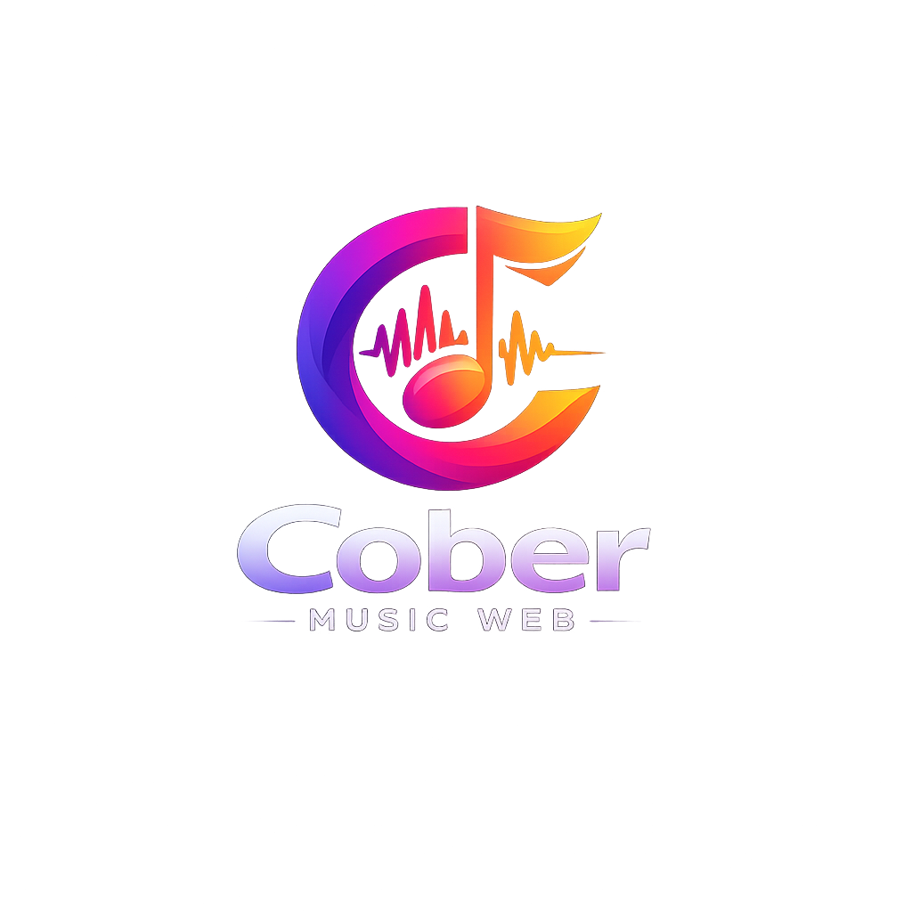
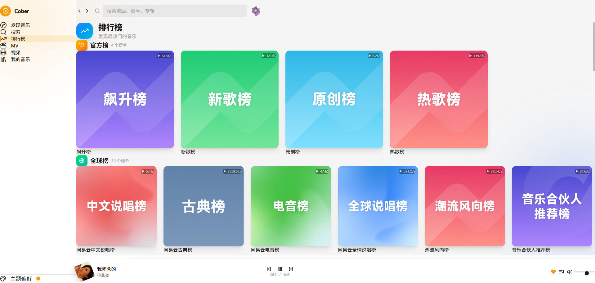
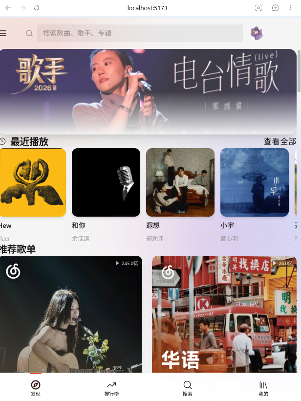
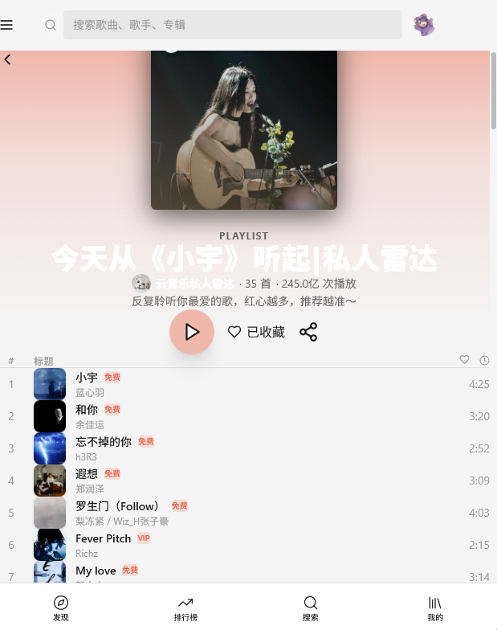
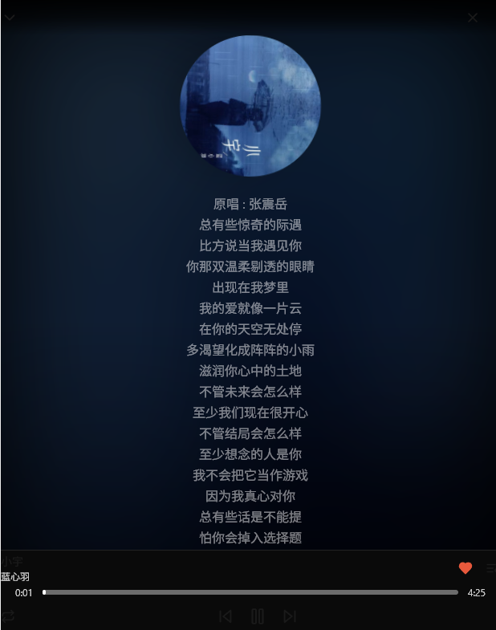

<div align="center">
  
  <h1>Cober Web Music</h1>
  <p><strong>基于 React + Vite 的第三方网易云音乐 Web 客户端</strong></p>
  <p>简洁 · 流畅 · 响应式</p>
</div>

<div align="center">
  
  
  
  
  
  
  
  
</div>

---

## 预览

| 桌面端主页 | 播放详情页 |
|:---:|:---:|
|  |  |

| 排行榜 | 手机端播放器 |
|:---:|:---:|
|  |  |

| 手机端播放器 | 手机端播放器 |
|:---:|:---:|
|  |  |

---

## 功能特性

- **双端适配** — 桌面端侧边栏 + 底部播放栏，移动端底部导航 + 迷你播放器
- **沉浸式播放** — 全屏播放页、毛玻璃背景、唱片旋转动画、逐行滚动歌词
- **主题系统** — 明暗切换、自定义主题色、跟随系统
- **登录方式** — 扫码登录、手机号登录
- **浏览发现** — 歌单、专辑、歌手、排行榜、MV、视频
- **个性化推荐** — 每日推荐、最新音乐、相似歌曲
- **音乐搜索** — 单曲 / 歌手 / 专辑 / 歌单 / MV 多维度搜索
- **播放控制** — 队列管理、四种模式（顺序 / 循环 / 随机 / 单曲循环）
- **收藏系统** — 收藏歌单 / 专辑 / 歌手、喜欢歌曲
- **音频功能** — 多音质（标准 / 高清 / 无损）、淡入淡出、播放历史
- **键盘快捷键** — 完整的键盘操作支持

---

## 技术栈

| 技术 | 用途 |
| --- | --- |
| **React 18** | UI 框架 |
| **Vite 6** | 构建工具 |
| **TypeScript 5** | 类型安全 |
| **Tailwind CSS 4** | 样式 |
| **Zustand** | 状态管理 |
| **React Router v6** | 路由 |
| **Howler.js** | 音频播放引擎 |
| **GSAP** | 动画引擎 |
| **Axios** | HTTP 请求 |
| **Lucide React** | 图标库 |
| **NeteaseCloudMusicApi** | 后端数据源 |

---

## 快速开始

确保已安装 [Node.js](https://nodejs.org/)（>= 18）。

### 1. 部署后端 API

本项目使用 [NeteaseCloudMusicApi](https://github.com/Binaryify/NeteaseCloudMusicApi) 作为数据源，需自行部署：

```bash
git clone https://github.com/Binaryify/NeteaseCloudMusicApi.git
cd NeteaseCloudMusicApi
node app.js
```

API 服务默认运行在 http://localhost:3000。

### 2. 配置环境变量

项目根目录下创建 .env 文件：

```env
VITE_API_BASE=http://localhost:3000
```

Vite 开发服务器已配置代理，将 /api 请求转发至此地址。

### 3. 安装并启动

```bash
git clone https://github.com/your-username/cober-web-music.git
cd cober-web-music

npm install
npm run dev
```

前端默认运行在 http://localhost:5173。

### 4. 构建

```bash
npm run build
npm run preview
```

---

## 项目结构

```
src/
├── api/           # API 请求封装
├── components/    # 通用组件 (Layout, Player)
├── hooks/         # 自定义 hooks
├── pages/         # 页面模块
│   ├── Album/
│   ├── Artist/
│   ├── Home/
│   ├── MV/
│   ├── Playlist/
│   ├── Ranking/
│   ├── Search/
│   ├── User/
│   └── Video/
├── stores/        # Zustand 状态管理
├── types/         # TypeScript 类型定义
└── utils/         # 工具函数
```

---

## 更新计划

- [ ] 桌面歌词
- [ ] 下载歌曲
- [ ] 歌词翻译与罗马音显示
- [ ] 本地音乐播放
- [ ] 音乐网盘

---

## 致谢

- [NeteaseCloudMusicApi](https://github.com/Binaryify/NeteaseCloudMusicApi) — 网易云音乐 API
- [Howler.js](https://github.com/goldfire/howler.js) — 音频引擎
- [GSAP](https://github.com/greensock/GSAP) — 动画引擎
- [Zustand](https://github.com/pmndrs/zustand) — 状态管理
- [Tailwind CSS](https://github.com/tailwindlabs/tailwindcss) — 样式框架
- [Lucide](https://github.com/lucide-icons/lucide) — 图标库

---

## 声明

- 本项目为个人学习用途的开源项目，仅供学习交流。
- 音乐数据及 API 来自第三方，版权归属于网易云音乐。**请勿用于任何商业用途。**

## 许可

[MIT](./LICENSE)
